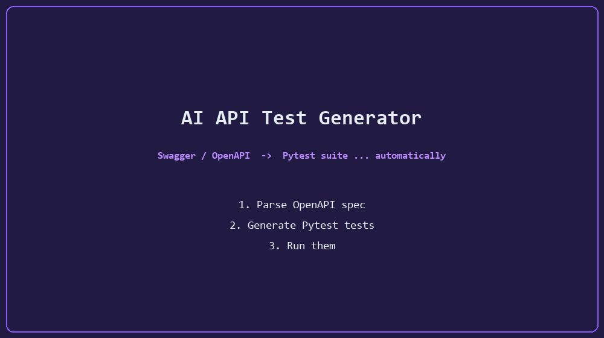

<div align="center">

# 🚀 AI API Test Generator

An automated Python-based tool that parses Swagger/OpenAPI documentation, extracts API endpoints, and automatically generates robust Pytest test cases to streamline backend testing.



<p>
  <a href="https://github.com/hajar-benhadj/AI-API-TEST-Generator/actions/workflows/ci.yml"></a>
  
  
  
  
</p>

</div>

---

## ✨ Key Features

* **📊 Automated Parsing:** Reads Swagger/OpenAPI specs in **JSON or YAML** and extracts every backend endpoint (GET, POST, PUT, PATCH, DELETE…).
* **🧪 Pytest Scaffolding:** Generates a clean, ready-to-run pytest suite — one test per endpoint, plus a negative test for unknown routes.
* **🎯 Configurable Base URL:** Point the generated tests at localhost, staging, or production with a single flag.
* **⚡ Instant Execution:** Run the generated suite automatically with `--run` right after generation.
* **📦 Installable:** Install it as a CLI with `pip install ai-api-test-gen` and generate tests from any directory.

## 📦 Installation

```bash
# From PyPI (once published)
pip install ai-api-test-gen

# Or from source
git clone https://github.com/hajar-benhadj/AI-API-TEST-Generator.git
cd AI-API-TEST-Generator
pip install -e .
```

> Optional: `pip install "ai-api-test-gen[openai]"` if you want to experiment with AI-assisted generation.

## 🚀 Usage

```bash
# Generate tests from the bundled sample spec
ai-api-test-gen samples/sample_swagger.json

# Point the generated tests at a real backend
ai-api-test-gen my_api.yaml -b https://api.example.com

# Generate AND run the suite immediately
ai-api-test-gen my_api.json --run

# Choose where the suite is written
ai-api-test-gen my_api.json -o tests/generated
```

Or without installing, from a source checkout:

```bash
python -m ai_api_test_gen samples/sample_swagger.json
```

The generated file lands in `generated_tests/test_generated_api.py` by default. Make sure your backend is running at the configured base URL, then:

```bash
pytest generated_tests/test_generated_api.py -v
```

## 📂 Project Structure

```
AI-API-TEST-GENERATOR/
│
├── src/ai_api_test_gen/
│   ├── __init__.py          # Package exports
│   ├── cli.py               # Command-line interface
│   ├── ai_generator.py      # Generates pytest test cases from endpoints
│   ├── executor.py          # Executes generated tests via pytest
│   └── parser.py            # Parses Swagger/OpenAPI JSON & YAML specs
│
├── tests/                   # Unit tests for the tool itself (CI-covered)
├── samples/                 # Sample Swagger/OpenAPI specs (JSON + YAML)
├── docs/                    # Demo assets
├── pyproject.toml           # Packaging metadata (pip-installable)
└── .github/workflows/       # CI: pytest across Python 3.9–3.12
```

## 🛠️ Technologies Used

* **Python 3.9+** — Core programming language.
* **Pytest** — Framework used to execute generated test suites.
* **Requests** — HTTP library used inside the generated tests.
* **PyYAML** — YAML spec support.
* **OpenAI API (optional)** — For experimenting with AI-assisted scaffolding.

## 🧪 Development

```bash
pip install -e ".[dev]"
pytest -v
```

CI runs the full test suite on every push and pull request across Python 3.9 → 3.12.

## 🤝 Contributing

Contributions are what make the open-source community such an amazing place to learn, inspire, and create. Any contributions you make are **greatly appreciated**.

1. Fork the Project
2. Create your Feature Branch (`git checkout -b feature/AmazingFeature`)
3. Commit your Changes (`git commit -m 'Add some AmazingFeature'`)
4. Push to the Branch (`git push origin feature/AmazingFeature`)
5. Open a Pull Request

## ⭐ Show Your Support

If this project saved you hours of writing API tests manually, please consider giving it a ⭐ — it helps other developers discover it!

## 📄 License

Distributed under the MIT License. See [`LICENSE`](LICENSE) for more information.
